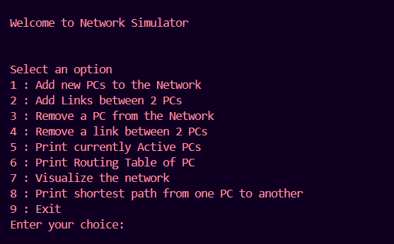
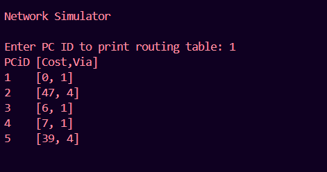
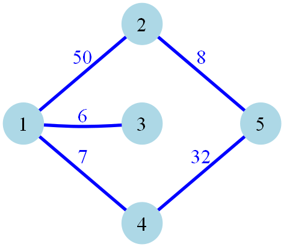
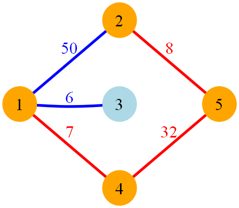

# Network-Simulation

This project is a simulation of a real-world **Link-State Routing Algorithm**, allowing for dynamic manipulation of network elements. With this simulation, you can add or remove routers, PCs, and links, demonstrating how routing algorithms adapt in real-time to changes in network topology. This simulation is built in **Python** using the `networkx` and `graphviz` libraries for efficient graph handling and visualization.

## Features

- **Dynamic Network Manipulation**: Add or remove routers/PCs and establish or delete connections between nodes in real-time.
- **Adaptive Link-State Routing**: The algorithm adapts automatically to changes, updating routing tables and paths across the network.
- **Custom Data Structures**: Data structures have been designed from scratch to support efficient storage and retrieval of network information.
- **Dijkstra's Algorithm**: Utilized to calculate the shortest path between two routers, enhancing pathfinding efficiency.
- **Graph Visualization**: Network structure and shortest paths are visualized using `networkx` and `graphviz` to illustrate the routing process dynamically.

## Technologies

- **Language**: Python
- **Libraries**: `networkx`, `graphviz`

## Project Structure

- **Simulated Routing**: Implements link-state routing, recalculating routes dynamically as the network changes.
- **Visualization**: Visualizes the entire network and shortest paths between nodes.

## Usage

1. **Initial Terminal Interface**
   

2. **Printing Routing Table**
   

3. **Visualizing the Network Graph**
   

4. **Visualizing the Shortest Path**
   

## How to Run

1. Install the required libraries:
   ```bash
   pip install networkx graphviz
   ```

2. Install graphviz tool from [official website](https://graphviz.org/download/) and add it to your PATH in windows. 

3. For checking proper installation of graphviz run
   ```bash
   dot -V
   ```
 
4. Run the network.py file for running the main program
   ```bash
   python Network.py
   ``` 